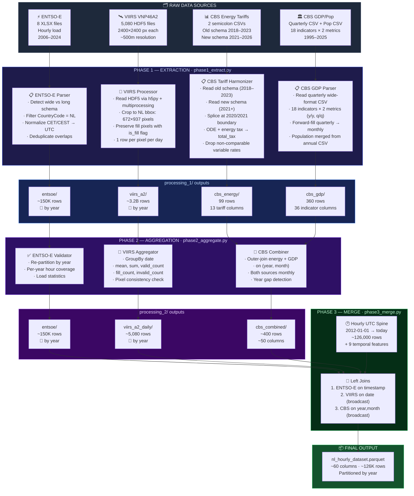
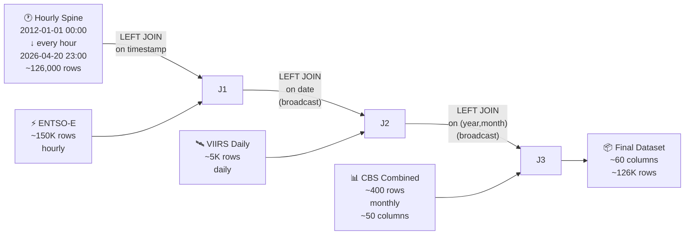
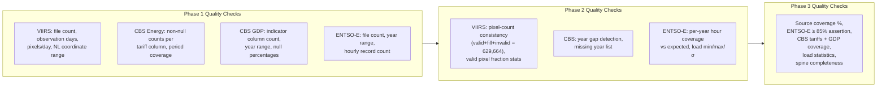

# NL Energy Demand — Data Pipeline Architecture

## Pipeline Overview Diagram



---

## Phase-by-Phase Detailed Breakdown

---

### Phase 1 — Extraction (`phase1_extract.py`)

> **Goal**: Read each raw heterogeneous source independently, clean it, and write a typed, normalised Parquet file. No cross-source logic.

---

#### 1A. VIIRS VNP46A2 — Satellite Nighttime Light

```
Input:  data/viirs/A2/*.h5  (5,080 files, ~70 GB total)
Output: data/processing_1/viirs_a2/data/  (partitioned by year)
```

````carousel
**Step 1 — NL Mask Computation**

The first HDF5 file is opened to read the 1D `lat` (2400,) and `lon` (2400,) coordinate arrays. These are **identical across all h18v03 files** (they define the fixed sinusoidal grid).

A Netherlands bounding box filter is applied:
- Latitude:  50.75° – 53.55° N → **672 pixel rows** (indices 1548–2219)
- Longitude:  3.35° –  7.25° E → **937 pixel columns** (indices 804–1740)

These index arrays are computed **once** and broadcast to all workers.
<!-- slide -->
**Step 2 — Parallel HDF5 Reading**

File paths are distributed across a `ProcessPoolExecutor` with ~96 workers. Each worker runs `h5py` to:
1. Open the `.h5` file
2. Read `Gap_Filled_DNB_BRDF-Corrected_NTL` (float32) — sliced to NL rectangle only
3. Read `Mandatory_Quality_Flag` (uint8) — same slice
4. Parse date from filename (`AYYYYDDD` → `datetime.date`)
<!-- slide -->
**Step 3 — Pixel Row Emission**

For each of the 672 × 937 = **629,664 pixels** per file:

| Column | Type | Description |
|---|---|---|
| `date` | DateType | Observation date |
| `year` | int | Year (partition key) |
| `row_idx` | int | Original raster row index |
| `col_idx` | int | Original raster column index |
| `lat` | double | Latitude (WGS84) |
| `lon` | double | Longitude (WGS84) |
| `ntl_radiance` | float | Raw radiance (nW/cm²/sr), **null if fill** |
| `quality_flag` | short | 0=best, 1=good, 255=no retrieval |
| `is_fill` | boolean | True if pixel was -999.9 (fill value) |

Fill pixels are **retained** (not discarded) so Phase 2 can count them.

**Total rows**: 629,664 × 5,080 ≈ **3.2 billion**
````

---

#### 1B. CBS Consumer Energy Tariffs (Harmonized)

```
Input:  data/cbs/Average_energy_prices_for_consumers__2018*.csv  (old schema)
        data/cbs/Average_energy_prices_for_consumers_2*.csv      (new schema)
Output: data/processing_1/cbs_energy/data/  (99 monthly rows)
```

The two CBS consumer tariff files use **different schemas** due to a methodology change:

| Schema | File | Covers | Columns | Notes |
|---|---|---|---|---|
| Old | `...__2018___2023_*.csv` | 2018–2023 | 11 value cols | Has ODE tax, "delivery rate" |
| New | `...consumers_*.csv` | 2021–2026 | 11 value cols | No ODE, "contract prices", adds dynamic contracts |

**Harmonization logic:**

1. **Old file contributes 2018-01 through 2020-12** — uses the well-established methodology
2. **New file contributes 2021-01 onward** — uses CBS's latest methodology
3. **Variable supply rates dropped** — the old "variable delivery rate" and new "variable contract price" are non-comparable due to the methodology break
4. **ODE tax merged from old → new** for 2021–2022 — the old file has ODE values for these years, which are needed for computing total tax
5. **`total_tax` computed** — `ODE + energy_tax` for ≤2022; `energy_tax` alone for ≥2023 (ODE was merged into the energy tax line by CBS)
6. **Dynamic contract columns** from new schema kept; `NULL` before 2025-01

**Output schema** — 13 `cbs_*` prefixed columns:

| Column | Unit | Coverage |
|---|---|---|
| `cbs_gas_transport_rate` | Euro/year | 2018–2026 |
| `cbs_gas_fixed_supply_rate` | Euro/year | 2018–2026 |
| `cbs_gas_ode_tax` | Euro/m³ | 2018–2022 only |
| `cbs_gas_energy_tax` | Euro/m³ | 2018–2026 |
| `cbs_gas_total_tax` | Euro/m³ | 2018–2026 (continuous) |
| `cbs_elec_transport_rate` | Euro/year | 2018–2026 |
| `cbs_elec_fixed_supply_rate` | Euro/year | 2018–2026 |
| `cbs_elec_fixed_supply_rate_dynamic` | Euro/year | 2025–2026 only |
| `cbs_elec_variable_supply_rate_dynamic` | Euro/kWh | 2025–2026 only |
| `cbs_elec_ode_tax` | Euro/kWh | 2018–2022 only |
| `cbs_elec_energy_tax` | Euro/kWh | 2018–2026 |
| `cbs_elec_total_tax` | Euro/kWh | 2018–2026 (continuous) |
| `cbs_elec_energy_tax_refund` | Euro/year | 2018–2026 |

---

#### 1C. CBS GDP / Quarterly National Accounts + Population

```
Input:  data/cbs/GDP__output_and_expenditures__changes__*.csv
        data/cbs/Population (x million).csv
Output: data/processing_1/cbs_gdp/data/  (360 monthly rows)
```

````carousel
**Step 1 — Parse Wide-Format CSV**

The CBS file has 4 header rows above the data. Row 5 contains `Topic;Periods;...period columns...`.

The period columns are split into two halves:
- **First half**: year-over-year (y/y) volume changes
- **Second half**: quarter-over-quarter (q/q) volume changes

18 indicator rows × 2 metric types = **36 columns** (35 in practice; GDP working-days-adjusted has no q/q series).
<!-- slide -->
**Step 2 — Quarterly → Monthly Forward-Fill**

Each quarterly value fills 3 months: Q1→Jan/Feb/Mar, Q2→Apr/May/Jun, etc.

Annual values are skipped (already covered by the 4 quarterly values).

Result: **360 monthly rows** (1996–2025 = 30 years × 12 months).
<!-- slide -->
**Step 3 — Population Merge**

Annual population from `Population (x million).csv` is left-joined on `year`, replicating to all 12 months.

**18 indicator base names** (each gets `_yy` and `_qq` suffixes):

| Indicator | Description |
|---|---|
| `disposable_total` | Total disposable for final expenditure |
| `gdp` | Gross domestic product |
| `gdp_wda` | GDP, working days adjusted (y/y only) |
| `imports_total` | Total imports of goods and services |
| `imports_goods` | Imports of goods |
| `imports_services` | Imports of services |
| `final_exp_total` | Total final expenditure |
| `natl_final_exp` | National final expenditure |
| `consumption_total` | Total final consumption expenditure |
| `consumption_hh` | Household consumption (including NPISHs) |
| `consumption_gov` | Government consumption |
| `capform_total` | Total gross fixed capital formation |
| `capform_enterprise` | Capital formation by enterprises/households |
| `capform_gov` | Capital formation by government |
| `inventories` | Changes in inventories incl. valuables |
| `exports_total` | Total exports of goods and services |
| `exports_goods` | Exports of goods |
| `exports_services` | Exports of services |
````

---

#### 1D. ENTSO-E Electricity Load

```
Input:  data/entso-e/*.xlsx  (8 files)
Output: data/processing_1/entsoe/data/  (partitioned by year, ~150K rows)
```

````carousel
**Schema Detection**

Each XLSX file is probed by reading the first 5 rows of its first sheet:
- If columns contain `"Country"` + numeric hour names like `"0.0"` → **wide format** (2006–2015 legacy)
- Otherwise → **long format** (2015+ standard)
<!-- slide -->
**Wide Format Processing (2006–2015)**

```
Raw:  Country | Year | Month | Day | CovRatio | 0.0 | 1.0 | ... | 23.0
       NL       2012    1       1      100      9832  9541  ...  10234
```

1. Filter `Country == 'NL'`
2. Melt 24 hour columns → individual rows
3. Build timestamp from (Year, Month, Day, Hour)
4. Localize as CET → convert to UTC
5. Ambiguous DST hours (fall-back) → set to NaT (dropped)
<!-- slide -->
**Long Format Processing (2015+)**

```
Raw:  MeasureItem | DateUTC | CountryCode | Value | ...
      MHLV         2020-01-01 00:00:00  NL   9832.5
```

1. Filter `CountryCode == 'NL'`
2. Parse `DateUTC` directly as UTC timestamp
3. Prefer `Value` column; fall back to `Value_ScaleTo100` if `Value` is all NaN
<!-- slide -->
**Deduplication**

Multiple files cover overlapping date ranges:
- `MHLV_data-2015-2019.xlsx` and `monthly_hourly_load_values_2019.xlsx` both contain 2019

Strategy: Sort by filename (alphabetical), **keep last** occurrence per timestamp.
Later single-year files override older bulk downloads → picks the more recently published data.

Final: truncate to whole hours with `floor("h")`, drop NaT/NaN rows.
````

---

### Phase 2 — Aggregation (`phase2_aggregate.py`)

> **Goal**: Reduce spatial VIIRS data to daily scalars, combine CBS tables, validate ENTSO-E.

---

#### 2A. VIIRS Daily Aggregates

```
Input:  data/processing_1/viirs_a2/data/  (3.2B pixel rows)
Output: data/processing_2/viirs_a2_daily/data/  (~5,080 rows, partitioned by year)
```

Groups all ~630K pixels per day into **one row per date** with five aggregate columns:

| Column | Aggregation | Filter |
|---|---|---|
| `ntl_mean` | `AVG(ntl_radiance)` | where `is_fill=false AND quality_flag ≤ 1` |
| `ntl_sum` | `SUM(ntl_radiance)` | where `is_fill=false AND quality_flag ≤ 1` |
| `ntl_valid_count` | `COUNT(*)` | where `is_fill=false AND quality_flag ≤ 1` |
| `ntl_fill_count` | `COUNT(*)` | where `is_fill=true` |
| `ntl_invalid_count` | `COUNT(*)` | where `is_fill=false AND quality_flag > 1` |

**Invariant check**: `ntl_valid_count + ntl_fill_count + ntl_invalid_count = 629,664` for every day.

---

#### 2B. CBS Combined

```
Input:  processing_1/cbs_energy/ + processing_1/cbs_gdp/
Output: data/processing_2/cbs_combined/data/  (~400 rows)
```

Outer-joins monthly energy tariffs with monthly GDP indicators on `(year, month)`. Both sources are now monthly-resolution — the energy tariffs are natively monthly (2018–2026) and the GDP indicators have been forward-filled from quarterly to monthly (1996–2025) in Phase 1. The resulting table has ~50 `cbs_*` columns. A year-gap check detects any missing calendar years.

---

#### 2C. ENTSO-E Validation

```
Input:  data/processing_1/entsoe/data/
Output: data/processing_2/entsoe/data/  (partitioned by year)
```

Pass-through re-partition with a detailed per-year coverage report:

| Year | Expected Hours | Actual | Coverage |
|---|---|---|---|
| 2012 | 8,784 (leap) | ~8,760 | 99.7% |
| 2020 | 8,784 (leap) | ~8,784 | 100.0% |
| ... | ... | ... | ... |

Also computes load statistics (min/max/mean/stddev) for sanity checking.

---

### Phase 3 — Merge (`phase3_merge.py`)

> **Goal**: Build one contiguous hourly dataset by joining all sources onto a synthetic timestamp spine.



#### Join Details

| # | Source | Join Key | Join Type | Strategy |
|---|---|---|---|---|
| 1 | ENTSO-E | `timestamp` | Left equi-join | Standard sort-merge (both sides ~100K+ rows) |
| 2 | VIIRS | `date` | Left + broadcast | VIIRS table (~5K rows) sent to all executors |
| 3 | CBS | `(year, month)` | Left + broadcast | CBS table (~400 rows) sent to all executors |

#### Temporal Feature Generation

Nine derived columns are added from the `timestamp`:

| Feature | Type | Example |
|---|---|---|
| `year` | int | 2024 |
| `month` | int | 3 |
| `day` | int | 15 |
| `hour` | int | 14 |
| `day_of_week` | int | 1=Sun … 7=Sat |
| `is_weekend` | int | 0 or 1 |
| `day_of_year` | int | 75 |
| `week_of_year` | int | 11 |
| `quarter` | int | 1 |

#### Column Ordering

Phase 3 arranges columns in a deterministic semantic order:

1. `timestamp` (primary key)
2. `entsoe_load_mw` (target variable)
3. VIIRS aggregates (`ntl_mean`, `ntl_sum`, etc.)
4. CBS energy tariffs (gas, then electricity — explicit order)
5. CBS GDP headline indicators (`cbs_gdp_yy`, `cbs_gdp_qq`, etc.)
6. CBS population
7. Any additional `cbs_*` columns (auto-appended in sorted order)
8. Temporal features (`year`, `month`, `day`, `hour`, etc.)

This ordering is forward-compatible: new `cbs_*` columns added in Phase 1 are automatically included without modifying Phase 3 code.

#### Final Output Schema

```
data/processed/nl_hourly_dataset.parquet/
├── year=2012/
├── year=2013/
├── ...
├── year=2026/
└── data_quality.json
```

| Group | Columns | Source | Native Res. | Notes |
|---|---|---|---|---|
| Target | `entsoe_load_mw` | ENTSO-E | Hourly | Target variable (MW) |
| Satellite | `ntl_mean`, `ntl_sum`, `ntl_valid_count`, `ntl_fill_count`, `ntl_invalid_count` | VIIRS | Daily | Spatial aggregates |
| Gas tariffs | `cbs_gas_transport_rate`, `cbs_gas_fixed_supply_rate`, `cbs_gas_ode_tax`, `cbs_gas_energy_tax`, `cbs_gas_total_tax` | CBS | Monthly | 2018–2026; ODE null after 2022 |
| Electricity tariffs | `cbs_elec_transport_rate`, `cbs_elec_fixed_supply_rate`, `cbs_elec_*_dynamic`, `cbs_elec_ode_tax`, `cbs_elec_energy_tax`, `cbs_elec_total_tax`, `cbs_elec_energy_tax_refund` | CBS | Monthly | 2018–2026; dynamic null before 2025 |
| GDP (y/y) | `cbs_gdp_yy`, `cbs_gdp_wda_yy`, `cbs_imports_total_yy`, ... (18 cols) | CBS | Quarterly→Monthly | 1996–2025, forward-filled |
| GDP (q/q) | `cbs_gdp_qq`, `cbs_imports_total_qq`, ... (17 cols) | CBS | Quarterly→Monthly | 1996–2025, forward-filled |
| Population | `cbs_population_million` | CBS | Annual→Monthly | Replicated to all months |
| Temporal | `year`, `month`, `day`, `hour`, `day_of_week`, `is_weekend`, `day_of_year`, `week_of_year`, `quarter` | Derived | Hourly | From timestamp |

---

## Data Quality Reports

Every phase produces a `data_quality.json` alongside its output:



Every JSON contains:
- **Row/column counts**
- **Per-column null count and percentage**
- **Disk size** (bytes + MB)
- **Date range** (min/max of temporal column)
- **Phase-specific extras** (pixel counts, load stats, coverage gaps, year lists)
