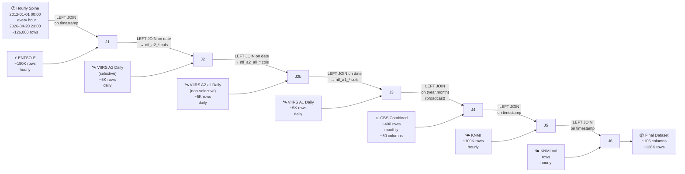

# NL Energy Demand — Data Pipeline Architecture

## Pipeline Overview Diagram

```mermaid
flowchart TD
    subgraph RAW["🗂️ RAW DATA SOURCES"]
        direction LR
        VA2_RAW["🛰️ VIIRS VNP46A2\n~5,080 HDF5 files\n2400×2400 px each\nGap-filled BRDF-corrected NTL"]
        VA1_RAW["🛰️ VIIRS VNP46A1\n~5,080 HDF5 files\n2400×2400 px each\nAt-sensor raw radiance"]
        C1_RAW["📊 CBS Energy Tariffs\n2 semicolon CSVs\nOld schema 2018–2023\nNew schema 2021–2026"]
        C3_RAW["📈 CBS Energy CPI\nConsumer Price Index\n2015=100 base year\n1996–2025"]
        C4_RAW["💶 CBS Gas & Elec. Prices\nSemi-annual GEP CSV\nEuro/m³ · Euro/kWh\n2009–2025"]
        C2_RAW["🏛️ CBS GDP/Pop\nQuarterly CSV + Pop CSV\n18 indicators × 2 metrics\n1995–2025"]
        E_RAW["⚡ ENTSO-E\n8 XLSX files\nHourly load\n2006–2024"]
        K_RAW["🌤️ KNMI\n~100K NetCDF files\nHourly in-situ meteo\n(non-validated)\n61 stations · 2015–2026+"]
        KV_RAW["🌤️ KNMI Validated\nNetCDF files\nHourly in-situ meteo\n(validated)\n61 stations · 2012–2025+"]
    end

    subgraph P1["PHASE 1 — EXTRACTION  ·  src/pipeline/phase1_extract.py"]
        direction TB
        VA2_1["🔬 VIIRS A2 Processor\n· Gap_Filled_DNB_BRDF-Corrected_NTL\n· Mandatory_Quality_Flag (uint8)\n· Crop to NL bbox + GADM polygon mask\n· 285,719 pixels/day\n· 1 row per pixel per day"]
        VA1_1["🔬 VIIRS A1 Processor\n· DNB_At_Sensor_Radiance\n· QF_DNB bits 0-1 → uint8 quality\n· Crop to NL bbox + GADM polygon mask\n· 285,719 pixels/day\n· 1 row per pixel per day"]
        C1_1["📋 CBS Tariff Harmonizer\n· Read old schema (2018–2023)\n· Read new schema (2021+)\n· Splice at 2020/2021 boundary\n· ODE + energy tax → total_tax\n· Drop non-comparable variable rates"]
        C3_1["📋 CBS CPI Parser\n· Parse Dutch month names\n· Drop annual summary rows\n· Convert comma decimals\n· 3 index series (energy/elec/gas)"]
        C4_1["📋 CBS GEP Parser\n· Parse semester periods\n· Drop annual rows\n· Pivot 3 components × 6 bands\n· Expand semester → 6 monthly rows\n· 18 price columns"]
        C2_1["📋 CBS GDP Parser\n· Read quarterly wide-format CSV\n· 18 indicators × 2 metrics (y/y, q/q)\n· Forward-fill quarterly → monthly\n· Population merged from annual CSV"]
        E1["📋 ENTSO-E Parser\n· Detect wide vs long schema\n· Filter CountryCode = NL\n· Normalize CET/CEST → UTC\n· Deduplicate overlaps"]
        K1["🌤️ KNMI Extractor\n· Read NetCDF via h5py\n· Mean across 61 stations\n· 8 weather variables\n· Hourly UTC timestamps\n· knmi_* columns"]
        KV1["🌤️ KNMI Val Extractor\n· Same as KNMI\n· knmi_val_* columns"]
    end

    subgraph P1_OUT["processing_1/ outputs"]
        direction LR
        VA2_1_O["viirs_a2/\n~3.2B rows\n📁 by year"]
        VA1_1_O["viirs_a1/\n~3.2B rows\n📁 by year"]
        C1_O["cbs_energy/\n99 rows\n13 tariff columns"]
        C3_O["cbs_cpi/\n360 rows\n3 index columns"]
        C4_O["cbs_gep/\n~204 rows\n18 price columns"]
        C2_O["cbs_gdp/\n360 rows\n36 indicator columns"]
        E1_O["entsoe/\n~150K rows\n📁 by year"]
        K1_O["knmi/\n~100K rows\n📁 by year"]
        KV1_O["knmi_validated/\nrows\n📁 by year"]
    end

    subgraph P2["PHASE 2 — AGGREGATION  ·  src/pipeline/phase2_aggregate.py"]
        direction TB
        VA2_2["📐 VIIRS A2 Aggregator\n· Selective: quality ≤ 1\n· GroupBy date\n· mean, sum, valid_count\n· fill_count, invalid_count"]
        VA2_ALL["📐 VIIRS A2-all Aggregator\n· Non-selective: all non-fill\n· GroupBy date\n· mean, sum, valid_count\n· fill_count, invalid_count"]
        VA1_2["📐 VIIRS A1 Aggregator\n· GroupBy date\n· mean, sum, valid_count\n· fill_count, invalid_count"]
        C2_2["🔗 CBS Combiner\n· Outer-join energy + GDP\n· + CPI + GEP\n· on (year, month)\n· Year gap detection"]
        E2["✅ ENTSO-E Validator\n· Re-partition by year\n· Per-year hour coverage\n· Load statistics"]
        K2["✅ KNMI Validator\n· Re-partition by year\n· Per-year hour coverage\n· Temperature statistics"]
        KV2["✅ KNMI Val Validator\n· Same as KNMI\n· knmi_val_* prefix"]
    end

    subgraph P2_OUT["processing_2/ outputs"]
        direction LR
        VA2_2_O["viirs_a2_daily/\n~5,080 rows\n📁 by year"]
        VA2_ALL_O["viirs_a2_all_daily/\n~5,080 rows\n📁 by year"]
        VA1_2_O["viirs_a1_daily/\n~5,080 rows\n📁 by year"]
        C2_O2["cbs_combined/\n~400 rows\n~70 columns"]
        E2_O["entsoe/\n~150K rows\n📁 by year"]
        K2_O["knmi/\n~100K rows\n📁 by year"]
        KV2_O["knmi_validated/\nrows\n📁 by year"]
    end

    subgraph P3["PHASE 3 — MERGE  ·  src/pipeline/phase3_merge.py"]
        direction TB
        SPINE["🕐 Hourly UTC Spine\n2012-01-01 → today\n~126,000 rows\n+ 9 temporal features"]
        JOIN["🔀 Left Joins\n1. ENTSO-E on timestamp\n2. VIIRS A2 on date → ntl_a2_*\n3. VIIRS A2-all on date → ntl_a2_all_*\n4. VIIRS A1 on date → ntl_a1_*\n5. CBS on year,month (broadcast)\n6. KNMI on timestamp → knmi_*\n7. KNMI Val on timestamp → knmi_val_*"]
    end

    subgraph FINAL["📦 FINAL OUTPUT"]
        OUT["nl_hourly_dataset.parquet\n~105 columns · ~126K rows\nPartitioned by year"]
    end

    VA2_RAW --> VA2_1
    VA1_RAW --> VA1_1
    C1_RAW --> C1_1
    C3_RAW --> C3_1
    C4_RAW --> C4_1
    C2_RAW --> C2_1
    E_RAW --> E1
    K_RAW --> K1
    KV_RAW --> KV1

    VA2_1 --> VA2_1_O
    VA1_1 --> VA1_1_O
    C1_1 --> C1_O
    C3_1 --> C3_O
    C4_1 --> C4_O
    C2_1 --> C2_O
    E1 --> E1_O
    K1 --> K1_O
    KV1 --> KV1_O

    VA2_1_O --> VA2_2
    VA2_1_O --> VA2_ALL
    VA1_1_O --> VA1_2
    C1_O --> C2_2
    C3_O --> C2_2
    C4_O --> C2_2
    C2_O --> C2_2
    E1_O --> E2
    K1_O --> K2
    KV1_O --> KV2

    VA2_2 --> VA2_2_O
    VA2_ALL --> VA2_ALL_O
    VA1_2 --> VA1_2_O
    C2_2 --> C2_O2
    E2 --> E2_O
    K2 --> K2_O
    KV2 --> KV2_O

    E2_O --> JOIN
    VA2_2_O --> JOIN
    VA2_ALL_O --> JOIN
    VA1_2_O --> JOIN
    C2_O2 --> JOIN
    K2_O --> JOIN
    KV2_O --> JOIN
    SPINE --> JOIN

    JOIN --> OUT

    style RAW fill:#1e293b,stroke:#475569,color:#e2e8f0
    style P1 fill:#1e1b4b,stroke:#4361ee,color:#c7d2fe
    style P1_OUT fill:#172554,stroke:#3b82f6,color:#bfdbfe
    style P2 fill:#2e1065,stroke:#7c3aed,color:#ddd6fe
    style P2_OUT fill:#3b0764,stroke:#a855f7,color:#e9d5ff
    style P3 fill:#052e16,stroke:#22c55e,color:#bbf7d0
    style FINAL fill:#14532d,stroke:#4ade80,color:#dcfce7
```



---

## Phase-by-Phase Detailed Breakdown

---

### Phase 1 — Extraction (`phase1_extract.py`)

> **Goal**: Read each raw heterogeneous source independently, clean it, and write a typed, normalised Parquet file. No cross-source logic.

---

#### 1A. VIIRS VNP46A2 and VNP46A1 — Satellite Nighttime Light

```
Input A2:  /projects/prjs2061/data/viirs/A2/*.h5  (~5,080 files — gap-filled BRDF-corrected NTL)
Output A2: data/processing_1/viirs_a2/data/  (partitioned by year)

Input A1:  /projects/prjs2061/data/viirs/A1/*.h5  (~5,080 files — at-sensor raw radiance)
Output A1: data/processing_1/viirs_a1/data/  (partitioned by year)
```

Both products are extracted by the same `extract_viirs()` function with a `product` parameter. They share the same HDF5 group (`HDFEOS/GRIDS/VIIRS_Grid_DNB_2d/Data Fields`), lat/lon structure, fill value (−999.9), and two-stage spatial filter. The only differences are the NTL and quality-flag dataset names:

| Aspect | VNP46A2 | VNP46A1 |
|---|---|---|
| NTL dataset | `Gap_Filled_DNB_BRDF-Corrected_NTL` | `DNB_At_Sensor_Radiance` |
| QF dataset | `Mandatory_Quality_Flag` (uint8) | `QF_DNB` (uint16 bitmask) |
| QF storage | Stored as-is | Bits 0-1 extracted → uint8 |
| Fill value | −999.9 | −999.9 |

````carousel
**Step 1 — NL Mask Computation (Two-Stage)**

The first HDF5 file is opened to read the 1D `lat` (2400,) and `lon` (2400,) coordinate arrays. These are **identical across all h18v03 files** (they define the fixed sinusoidal grid).

**Stage 1 — Bounding-box crop** (fast first pass):
- Latitude:  50.75° – 53.55° N → **672 pixel rows** (indices 1548–2219)
- Longitude:  3.35° –  7.25° E → **937 pixel columns** (indices 804–1740)
- Result: 672 × 937 = **629,664** candidate pixels

**Stage 2 — GADM polygon mask** (precise):
- Loads the GADM 4.1 Netherlands Level 0 boundary (`data/geo/gadm41_NLD_0.json` — land + islands, WGS84)
- Runs `shapely.contains_xy()` on all 629,664 bounding-box pixels (~0.3 s, fully vectorised)
- Result: **285,719** pixels (45.4%) are inside the Netherlands polygon
- Excluded: North Sea pixels, Belgian border slivers (south Limburg), German border slivers (east Drenthe/Overijssel)

Both the bounding-box indices and the 2D boolean polygon mask are computed **once** and broadcast to all workers.
<!-- slide -->
**Step 2 — Parallel HDF5 Reading**

File paths are distributed across a `ProcessPoolExecutor` with ~96 workers. Each worker reads one HDF5 file using `h5py`, sliced to the NL rectangle only, and parses the date from the filename (`AYYYYDDD` → `datetime.date`).

For **A1**, `QF_DNB` is a uint16 bitmask; bits 0–1 are extracted into a uint8 quality tier (0=best, 1=low, 2=poor, 3=no retrieval) — identical semantics to A2's `Mandatory_Quality_Flag`.
<!-- slide -->
**Step 3 — Polygon Masking and Pixel Row Emission**

After slicing the HDF5 data to the bounding-box rectangle, the 2D polygon mask is applied via NumPy boolean indexing: only pixels where `nl_pixel_mask[i,j] == True` are included in the output DataFrame. This eliminates non-Dutch pixels before writing to Parquet.

The output schema is **identical** for both products:

| Column | Type | Description |
|---|---|---|
| `date` | DateType | Observation date |
| `year` | int | Year (partition key) |
| `row_idx` | int | Original raster row index |
| `col_idx` | int | Original raster column index |
| `lat` | double | Latitude (WGS84) |
| `lon` | double | Longitude (WGS84) |
| `ntl_radiance` | float | NTL radiance (nW/cm²/sr), **null if fill** |
| `quality_flag` | uint8 | 0=best, 1=good, 2+=degraded/no retrieval |
| `is_fill` | boolean | True if pixel was −999.9 (fill value) |

Fill pixels are **retained** (not discarded) so Phase 2 can count them.

**Total rows per product**: 285,719 × ~5,080 ≈ **1.45 billion**
````

---

#### 1B. CBS Consumer Energy Tariffs (Harmonized)

```
Input:  /projects/prjs2061/data/cbs/Average_energy_prices_for_consumers__2018*.csv  (old schema)
        /projects/prjs2061/data/cbs/Average_energy_prices_for_consumers_2*.csv      (new schema)
Output: data/processing_1/cbs_energy/data/  (99 monthly rows)
```

The two CBS consumer tariff files use **different schemas** due to a methodology change:

| Schema | File | Covers | Columns | Notes |
|---|---|---|---|---|
| Old | `...__2018___2023_*.csv` | 2018–2023 | 11 value cols | Has ODE tax, "delivery rate" |
| New | `...consumers_*.csv` | 2021–2026 | 11 value cols | No ODE, "contract prices", adds dynamic contracts |

**Harmonization logic:**

1. **Old file contributes 2018-01 through 2020-12** — uses the well-established methodology
2. **New file contributes 2021-01 onward** — uses CBS's latest methodology
3. **Variable supply rates dropped** — the old "variable delivery rate" and new "variable contract price" are non-comparable due to the methodology break
4. **ODE tax merged from old → new** for 2021–2022 — the old file has ODE values for these years, which are needed for computing total tax
5. **`total_tax` computed** — `ODE + energy_tax` for ≤2022; `energy_tax` alone for ≥2023 (ODE was merged into the energy tax line by CBS)
6. **Dynamic contract columns** from new schema kept; `NULL` before 2025-01

**Output schema** — 13 `cbs_*` prefixed columns:

| Column | Unit | Coverage |
|---|---|---|
| `cbs_gas_transport_rate` | Euro/year | 2018–2026 |
| `cbs_gas_fixed_supply_rate` | Euro/year | 2018–2026 |
| `cbs_gas_ode_tax` | Euro/m³ | 2018–2022 only |
| `cbs_gas_energy_tax` | Euro/m³ | 2018–2026 |
| `cbs_gas_total_tax` | Euro/m³ | 2018–2026 (continuous) |
| `cbs_elec_transport_rate` | Euro/year | 2018–2026 |
| `cbs_elec_fixed_supply_rate` | Euro/year | 2018–2026 |
| `cbs_elec_fixed_supply_rate_dynamic` | Euro/year | 2025–2026 only |
| `cbs_elec_variable_supply_rate_dynamic` | Euro/kWh | 2025–2026 only |
| `cbs_elec_ode_tax` | Euro/kWh | 2018–2022 only |
| `cbs_elec_energy_tax` | Euro/kWh | 2018–2026 |
| `cbs_elec_total_tax` | Euro/kWh | 2018–2026 (continuous) |
| `cbs_elec_energy_tax_refund` | Euro/year | 2018–2026 |

---

#### 1C. CBS GDP / Quarterly National Accounts + Population

```
Input:  /projects/prjs2061/data/cbs/GDP__output_and_expenditures__changes__*.csv
        /projects/prjs2061/data/cbs/Population (x million).csv
Output: data/processing_1/cbs_gdp/data/  (360 monthly rows)
```

````carousel
**Step 1 — Parse Wide-Format CSV**

The CBS file has 4 header rows above the data. Row 5 contains `Topic;Periods;...period columns...`.

The period columns are split into two halves:
- **First half**: year-over-year (y/y) volume changes
- **Second half**: quarter-over-quarter (q/q) volume changes

18 indicator rows × 2 metric types = **36 columns** (35 in practice; GDP working-days-adjusted has no q/q series).
<!-- slide -->
**Step 2 — Quarterly → Monthly Forward-Fill**

Each quarterly value fills 3 months: Q1→Jan/Feb/Mar, Q2→Apr/May/Jun, etc.

Annual values are skipped (already covered by the 4 quarterly values).

Result: **360 monthly rows** (1996–2025 = 30 years × 12 months).
<!-- slide -->
**Step 3 — Population Merge**

Annual population from `Population (x million).csv` is left-joined on `year`, replicating to all 12 months.

**18 indicator base names** (each gets `_yy` and `_qq` suffixes):

| Indicator | Description |
|---|---|
| `disposable_total` | Total disposable for final expenditure |
| `gdp` | Gross domestic product |
| `gdp_wda` | GDP, working days adjusted (y/y only) |
| `imports_total` | Total imports of goods and services |
| `imports_goods` | Imports of goods |
| `imports_services` | Imports of services |
| `final_exp_total` | Total final expenditure |
| `natl_final_exp` | National final expenditure |
| `consumption_total` | Total final consumption expenditure |
| `consumption_hh` | Household consumption (including NPISHs) |
| `consumption_gov` | Government consumption |
| `capform_total` | Total gross fixed capital formation |
| `capform_enterprise` | Capital formation by enterprises/households |
| `capform_gov` | Capital formation by government |
| `inventories` | Changes in inventories incl. valuables |
| `exports_total` | Total exports of goods and services |
| `exports_goods` | Exports of goods |
| `exports_services` | Exports of services |
````

---

#### 1D. CBS Consumer Price Index (CPI) — Energy

```
Input:  /projects/prjs2061/data/cbs/Consumentenprijzen__prijsindex_2015_100__*.csv
Output: data/processing_1/cbs_cpi/data/  (360 monthly rows)
```

The CBS CPI file contains three monthly price-index series, all normalised to **2015 = 100**:

| Output column | CBS code | What it measures |
|---|---|---|
| `cbs_cpi_energy` | 045000 Energie | Overall energy basket (electricity + gas, household-weighted) |
| `cbs_cpi_electricity` | 045100 Elektriciteit | Electricity component |
| `cbs_cpi_gas` | 045200 Gas | Gas component |

**What a CPI value means.** If `cbs_cpi_energy = 162` in a given month, energy costs 62 % more than in 2015. The index captures the *relative movement* of prices rather than their absolute level, making it directly comparable across all years from 1996 to 2025.

**How it complements the tariff files.** The tariff files record the actual euros consumers pay per kWh or m³, broken down by component (transport, taxes, supply). The CPI records how the overall price level has shifted. Both signals are useful for demand modelling, and crucially the CPI **fills the 2012–2017 gap** where the tariff data is absent.

**Parsing notes.** The file uses Dutch month names (`januari`–`december`) and comma decimal separators (`42,06` → 42.06). Annual summary rows (one per calendar year) are filtered out; only the 12 monthly rows per year are retained.

---

#### 1E. CBS Gas & Electricity Prices (GEP)

```
Input:  /projects/prjs2061/data/cbs/Prices_of_natural_gas_and_electricity_*.csv
Output: data/processing_1/cbs_gep/data/  (~204 monthly rows)
```

The CBS GEP file contains semi-annual prices for **six consumption-band segments** across **three price components**, including VAT and all taxes:

| Output column prefix | Consumption band | Unit |
|---|---|---|
| `cbs_gep_gas_hh_*` | Gas household (569–5 687 m³/yr) | €/m³ |
| `cbs_gep_gas_nnh_med_*` | Gas non-household medium (28 433–284 333 m³/yr) | €/m³ |
| `cbs_gep_gas_nnh_lrg_*` | Gas non-household large (≥28 433 324 m³/yr) | €/m³ |
| `cbs_gep_elec_hh_*` | Electricity household (2.5–5 MWh/yr) | €/kWh |
| `cbs_gep_elec_nnh_med_*` | Electricity non-household medium (500–2 000 MWh/yr) | €/kWh |
| `cbs_gep_elec_nnh_lrg_*` | Electricity non-household large (≥150 000 MWh/yr) | €/kWh |

Each prefix gets three `_{component}` suffixes: `_total`, `_supply`, `_network` → **18 columns total**.

**Parsing logic.**
The file is in long format with 3 rows per period (Total/Supply/Network price) and 6 value columns. The extractor:
1. Skips the 5-line header and drops the footer row.
2. Parses period strings (`"2009 1st semester"`, `"2025 2nd semester*"`) and drops annual-average rows.
3. Maps component labels to short tags via `_GEP_COMPONENT_MAP`.
4. Melts the 6 value columns into long format, constructs `cbs_gep_{band}_{component}` column names, and pivots to wide.
5. Expands each semester to 6 monthly rows (H1→Jan-Jun, H2→Jul-Dec).

Coverage: H1 2009 – H2 2025 (~204 monthly rows).

---

#### 1F. ENTSO-E Electricity Load

```
Input:  /projects/prjs2061/data/entso-e/*.xlsx  (8 files)
Output: data/processing_1/entsoe/data/  (partitioned by year, ~150K rows)
```

````carousel
**Schema Detection**

Each XLSX file is probed by reading the first 5 rows of its first sheet:
- If columns contain `"Country"` + numeric hour names like `"0.0"` → **wide format** (2006–2015 legacy)
- Otherwise → **long format** (2015+ standard)
<!-- slide -->
**Wide Format Processing (2006–2015)**

```
Raw:  Country | Year | Month | Day | CovRatio | 0.0 | 1.0 | ... | 23.0
       NL       2012    1       1      100      9832  9541  ...  10234
```

1. Filter `Country == 'NL'`
2. Melt 24 hour columns → individual rows
3. Build timestamp from (Year, Month, Day, Hour)
4. Localize as CET → convert to UTC
5. Ambiguous DST hours (fall-back) → set to NaT (dropped)
<!-- slide -->
**Long Format Processing (2015+)**

```
Raw:  MeasureItem | DateUTC | CountryCode | Value | ...
      MHLV         2020-01-01 00:00:00  NL   9832.5
```

1. Filter `CountryCode == 'NL'`
2. Parse `DateUTC` directly as UTC timestamp
3. Prefer `Value` column; fall back to `Value_ScaleTo100` if `Value` is all NaN
<!-- slide -->
**Deduplication**

Multiple files cover overlapping date ranges:
- `MHLV_data-2015-2019.xlsx` and `monthly_hourly_load_values_2019.xlsx` both contain 2019

Strategy: Sort by filename (alphabetical), **keep last** occurrence per timestamp.
Later single-year files override older bulk downloads → picks the more recently published data.

Final: truncate to whole hours with `floor("h")`, drop NaT/NaN rows.
````

---

#### 1G. KNMI Hourly Meteorological Observations

```
Input:  /projects/prjs2061/data/knmi/hourly-observations-*.nc  (~25K files)
Output: data/processing_1/knmi/data/  (partitioned by year, ~25K rows)
```

The KNMI Open Data API provides hourly in-situ meteorological observations from **61 weather stations** across the Netherlands in NetCDF4 format (which is HDF5-based, so `h5py` reads them natively — no extra dependency needed).

Each file contains one hour of observations. The extractor uses `ProcessPoolExecutor` (same pattern as VIIRS) to read all files in parallel. For each file, it reads 8 meteorological variables and computes the **mean across all reporting stations** (ignoring NaN) to produce one national-level hourly value.

**Output schema** — one row per hour:

| Column | Type | Unit | Description |
|---|---|---|---|
| `timestamp_utc` | datetime64 | — | Observation hour (UTC) |
| `knmi_temp_c` | float64 | °C | Temperature at 1.5m |
| `knmi_dewpoint_c` | float64 | °C | Dew point temperature |
| `knmi_wind_speed_ms` | float64 | m/s | 10-min mean wind speed |
| `knmi_wind_speed_hourly_ms` | float64 | m/s | Hourly mean wind speed |
| `knmi_wind_gust_ms` | float64 | m/s | Maximum wind gust |
| `knmi_solar_rad_jcm2` | float64 | J/cm² | Global solar radiation |
| `knmi_sunshine_h` | float64 | h | Sunshine duration |
| `knmi_humidity_pct` | float64 | % | Relative humidity |
| `knmi_station_count` | int32 | — | Number of reporting stations |

Coverage: 2015-01 – 2026 (or latest download date).

---

#### 1H. KNMI Validated Hourly Meteorological Observations

```
Input:  /projects/prjs2061/data/knmi_validated/hourly-observations-*.nc
Output: data/processing_1/knmi_validated/data/  (partitioned by year)
```

Identical processing to Phase 1G, but reads from the **validated** dataset directory. All output columns use the `knmi_val_` prefix (e.g. `knmi_val_temp_c`, `knmi_val_wind_speed_ms`). This is the KNMI expert-reviewed version of the hourly observations, which may contain corrections to erroneous automated measurements.

Coverage may differ from the non-validated dataset (validated data typically lags behind by several months).

---

### Phase 2 — Aggregation (`phase2_aggregate.py`)

> **Goal**: Reduce spatial VIIRS data to daily scalars (both selective and non-selective pixel filters), combine CBS tables, validate ENTSO-E and KNMI.

---

#### 2A. VIIRS Daily Aggregates (A2 selective, A2-all, and A1)

```
Input A2:  data/processing_1/viirs_a2/data/   (1.45B pixel rows)
Output A2 (selective): data/processing_2/viirs_a2_daily/data/  (~5,080 rows, partitioned by year)
Output A2 (non-selective): data/processing_2/viirs_a2_all_daily/data/  (~5,080 rows, partitioned by year)

Input A1:  data/processing_1/viirs_a1/data/   (1.45B pixel rows, partitioned by year)
Output A1: data/processing_2/viirs_a1_daily/data/  (~5,080 rows, partitioned by year)
```

Both products are aggregated by the same `aggregate_viirs()` function (with `product` and `selective` parameters). For VNP46A2, two modes are run:

| Mode | `selective` | Pixels in `ntl_mean`/`ntl_sum` | Output dir | Column prefix |
|---|---|---|---|---|
| A2 selective | `True` | `quality_flag ≤ 1` AND not fill (high-quality, directly observed) | `viirs_a2_daily/` | `ntl_a2_` |
| A2 non-selective (A2-all) | `False` | All non-fill pixels (quality 0–3, including gap-filled/imputed) | `viirs_a2_all_daily/` | `ntl_a2_all_` |
| A1 selective | `True` | `quality_flag ≤ 1` AND not fill | `viirs_a1_daily/` | `ntl_a1_` |

> **Why A2-all?** The selective A2 version exhibits severe survivorship bias — summer nights are short and heavily cloud-masked, so only a small fraction of pixels pass the quality ≤ 1 filter, creating a spurious "summer peak" artifact. A2-all includes gap-filled/imputed pixels (quality 2–3), eliminating this selection bias and achieving ~97.5% hourly coverage (vs ~76% for selective A2). However, the imputed values reflect historical climatological composites, producing a smoother signal with weaker load correlation.

Each run groups all ~286K pixels per day into **one row per date** with five aggregate columns:

In all three modes, the pixel-count breakdown uses the same fixed definitions:

| Column | Aggregation | Filter |
|---|---|---|
| `ntl_mean` | `AVG(ntl_radiance)` | **Selective**: `is_fill=false AND quality_flag ≤ 1`; **Non-selective**: `is_fill=false` |
| `ntl_sum` | `SUM(ntl_radiance)` | Same as `ntl_mean` |
| `ntl_valid_count` | `COUNT(*)` | where `is_fill=false AND quality_flag ≤ 1` (always) |
| `ntl_fill_count` | `COUNT(*)` | where `is_fill=true` (always) |
| `ntl_invalid_count` | `COUNT(*)` | where `is_fill=false AND quality_flag > 1` (always) |

**Minimum coverage filter (10%)**:  After aggregation, days where the contributing pixel count is below 10% of the NL polygon mask (285,719 × 0.10 = 28,571 pixels) have their `ntl_mean` and `ntl_sum` set to `null`. This prevents extreme survivorship bias from corrupting daily statistics on nights with very sparse clear-sky observations. For selective products, the contributing count is `ntl_valid_count`; for non-selective, it is `ntl_valid_count + ntl_invalid_count` (all non-fill pixels). Pixel counts are preserved regardless of the filter for diagnostic use.

**Invariant check**: `ntl_valid_count + ntl_fill_count + ntl_invalid_count = 285,719` for every day.

---

#### 2B. CBS Combined

```
Input:  data/processing_1/cbs_energy/ + data/processing_1/cbs_gdp/ + data/processing_1/cbs_cpi/ + data/processing_1/cbs_gep/
Output: data/processing_2/cbs_combined/data/  (~400 rows)
```

Outer-joins all four monthly CBS sources on `(year, month)` via a broadcast-join loop:

| Source | Coverage | Columns added |
|---|---|---|
| CBS Energy | 2018–2026 | 13 `cbs_gas_*` / `cbs_elec_*` tariff columns |
| CBS GDP | 1996–2025 | 35 `cbs_*_yy` / `cbs_*_qq` + `cbs_population_million` |
| CBS CPI | 1996–2025 | `cbs_cpi_energy`, `cbs_cpi_electricity`, `cbs_cpi_gas` |
| CBS GEP | 2009–2025 | 18 `cbs_gep_{band}_{component}` price columns |

The outer join preserves all months present in any source (effectively 1996–2026). Tariff columns are null before 2018; GEP columns are null before 2009; CPI and GDP columns are null before 1996. A year-gap check detects any missing calendar years.

---

#### 2C. ENTSO-E Validation

```
Input:  data/processing_1/entsoe/data/
Output: data/processing_2/entsoe/data/  (partitioned by year)
```

Pass-through re-partition with a detailed per-year coverage report:

| Year | Expected Hours | Actual | Coverage |
|---|---|---|---|
| 2012 | 8,784 (leap) | ~8,760 | 99.7% |
| 2020 | 8,784 (leap) | ~8,784 | 100.0% |
| ... | ... | ... | ... |

Also computes load statistics (min/max/mean/stddev) for sanity checking.

#### 2D. KNMI Validation

```
Input:  data/processing_1/knmi/data/
Output: data/processing_2/knmi/data/  (partitioned by year)
```

Pass-through re-partition with a detailed quality report:
- Per-year hour coverage vs expected (8760/8784)
- Temperature statistics (min/max/mean/stddev) for sanity checking
- Per-variable null percentages

#### 2E. KNMI Validated Validation

```
Input:  data/processing_1/knmi_validated/data/
Output: data/processing_2/knmi_validated/data/  (partitioned by year)
```

Same pass-through re-partition as 2D, but for the validated dataset. Uses `knmi_val_` column prefix for quality statistics.

---

### Phase 3 — Merge (`phase3_merge.py`)

> **Goal**: Build one contiguous hourly dataset by joining all sources onto a synthetic timestamp spine.



#### Join Details

| # | Source | Join Key | Output Columns | Strategy |
|---|---|---|---|---|
| 1 | ENTSO-E | `timestamp` | `entsoe_load_mw` | Left equi-join |
| 2 | VIIRS A2 (selective) | `date` | `ntl_a2_mean`, `ntl_a2_sum`, `ntl_a2_valid_count`, `ntl_a2_fill_count`, `ntl_a2_invalid_count` | Left + broadcast |
| 3 | VIIRS A2-all (non-selective) | `date` | `ntl_a2_all_mean`, `ntl_a2_all_sum`, `ntl_a2_all_valid_count`, `ntl_a2_all_fill_count`, `ntl_a2_all_invalid_count` | Left + broadcast |
| 4 | VIIRS A1 | `date` | `ntl_a1_mean`, `ntl_a1_sum`, `ntl_a1_valid_count`, `ntl_a1_fill_count`, `ntl_a1_invalid_count` | Left + broadcast |
| 5 | CBS | `(year, month)` | All `cbs_*` columns | Left + broadcast |
| 6 | KNMI | `timestamp` | `knmi_temp_c`, `knmi_dewpoint_c`, `knmi_wind_speed_ms`, `knmi_wind_speed_hourly_ms`, `knmi_wind_gust_ms`, `knmi_solar_rad_jcm2`, `knmi_sunshine_h`, `knmi_humidity_pct`, `knmi_station_count` | Left equi-join |
| 7 | KNMI Validated | `timestamp` | `knmi_val_temp_c`, `knmi_val_dewpoint_c`, `knmi_val_wind_speed_ms`, `knmi_val_wind_speed_hourly_ms`, `knmi_val_wind_gust_ms`, `knmi_val_solar_rad_jcm2`, `knmi_val_sunshine_h`, `knmi_val_humidity_pct`, `knmi_val_station_count` | Left equi-join |

#### Temporal Feature Generation

Nine derived columns are added from the `timestamp`:

| Feature | Type | Example |
|---|---|---|
| `year` | int | 2024 |
| `month` | int | 3 |
| `day` | int | 15 |
| `hour` | int | 14 |
| `day_of_week` | int | 1=Sun … 7=Sat |
| `is_weekend` | int | 0 or 1 |
| `day_of_year` | int | 75 |
| `week_of_year` | int | 11 |
| `quarter` | int | 1 |

#### Column Ordering

Phase 3 arranges columns in a deterministic semantic order:

1. `timestamp` (primary key)
2. `entsoe_load_mw` (target variable)
3. VIIRS A2 selective aggregates (`ntl_a2_mean`, `ntl_a2_sum`, etc.)
4. VIIRS A2-all non-selective aggregates (`ntl_a2_all_mean`, `ntl_a2_all_sum`, etc.)
5. VIIRS A1 aggregates (`ntl_a1_mean`, `ntl_a1_sum`, etc.)
6. CBS energy tariffs (gas, then electricity — explicit order)
7. CBS GDP headline indicators (`cbs_gdp_yy`, `cbs_gdp_qq`, etc.)
8. CBS population
9. Any additional `cbs_*` columns (auto-appended in sorted order)
10. KNMI meteorological (`knmi_temp_c`, `knmi_wind_speed_ms`, etc.)
11. Any additional `knmi_*` columns (non-validated, auto-appended in sorted order)
12. KNMI validated meteorological (`knmi_val_temp_c`, `knmi_val_wind_speed_ms`, etc.)
13. Any additional `knmi_val_*` columns (auto-appended in sorted order)
14. Temporal features (`year`, `month`, `day`, `hour`, etc.)

This ordering is forward-compatible: new `cbs_*` or `knmi_*` columns added in Phase 1 are automatically included without modifying Phase 3 code.

#### Final Output Schema

```
data/processed/nl_hourly_dataset.parquet/
├── year=2012/
├── year=2013/
├── ...
├── year=2026/
└── data_quality.json
```

| Group | Columns | Source | Native Res. | Notes |
|---|---|---|---|---|
| Target | `entsoe_load_mw` | ENTSO-E | Hourly | Target variable (MW) |
| Satellite A2 (selective) | `ntl_a2_mean`, `ntl_a2_sum`, `ntl_a2_valid_count`, `ntl_a2_fill_count`, `ntl_a2_invalid_count` | VIIRS VNP46A2 | Daily | Quality ≤ 1 pixels only; ~76% hourly coverage |
| Satellite A2-all (non-selective) | `ntl_a2_all_mean`, `ntl_a2_all_sum`, `ntl_a2_all_valid_count`, `ntl_a2_all_fill_count`, `ntl_a2_all_invalid_count` | VIIRS VNP46A2 | Daily | All non-fill pixels (incl. gap-filled/imputed); ~97.5% hourly coverage |
| Satellite A1 | `ntl_a1_mean`, `ntl_a1_sum`, `ntl_a1_valid_count`, `ntl_a1_fill_count`, `ntl_a1_invalid_count` | VIIRS VNP46A1 | Daily | At-sensor raw radiance spatial aggregates |
| Gas tariffs | `cbs_gas_transport_rate`, `cbs_gas_fixed_supply_rate`, `cbs_gas_ode_tax`, `cbs_gas_energy_tax`, `cbs_gas_total_tax` | CBS | Monthly | 2018–2026; ODE null after 2022 |
| Electricity tariffs | `cbs_elec_transport_rate`, `cbs_elec_fixed_supply_rate`, `cbs_elec_*_dynamic`, `cbs_elec_ode_tax`, `cbs_elec_energy_tax`, `cbs_elec_total_tax`, `cbs_elec_energy_tax_refund` | CBS | Monthly | 2018–2026; dynamic null before 2025 |
| GDP (y/y) | `cbs_gdp_yy`, `cbs_gdp_wda_yy`, `cbs_imports_total_yy`, ... (18 cols) | CBS | Quarterly→Monthly | 1996–2025, forward-filled |
| GDP (q/q) | `cbs_gdp_qq`, `cbs_imports_total_qq`, ... (17 cols) | CBS | Quarterly→Monthly | 1996–2025, forward-filled |
| Population | `cbs_population_million` | CBS | Annual→Monthly | Replicated to all months |
| Energy CPI | `cbs_cpi_energy`, `cbs_cpi_electricity`, `cbs_cpi_gas` | CBS | Monthly | Index (2015=100), 1996–2025 |
| Gas & Elec. Prices | `cbs_gep_{gas_hh,gas_nnh_med,...}_{total,supply,network}` (18 cols) | CBS GEP | Semi-annual→Monthly | €/m³ or €/kWh, incl. VAT/taxes, 2009–2025 |
| Meteorology | `knmi_temp_c`, `knmi_dewpoint_c`, `knmi_wind_speed_ms`, `knmi_wind_speed_hourly_ms`, `knmi_wind_gust_ms`, `knmi_solar_rad_jcm2`, `knmi_sunshine_h`, `knmi_humidity_pct`, `knmi_station_count` | KNMI | Hourly | National mean across 61 stations (non-validated) |
| Meteorology (Validated) | `knmi_val_temp_c`, `knmi_val_dewpoint_c`, `knmi_val_wind_speed_ms`, `knmi_val_wind_speed_hourly_ms`, `knmi_val_wind_gust_ms`, `knmi_val_solar_rad_jcm2`, `knmi_val_sunshine_h`, `knmi_val_humidity_pct`, `knmi_val_station_count` | KNMI Validated | Hourly | National mean across 61 stations (expert-validated) |
| Temporal | `year`, `month`, `day`, `hour`, `day_of_week`, `is_weekend`, `day_of_year`, `week_of_year`, `quarter` | Derived | Hourly | From timestamp |

---

## Data Quality Reports

Every phase produces a `data_quality.json` alongside its output:

```mermaid
flowchart LR
    subgraph P1_QC["Phase 1 Quality Checks"]
        Q1A["VIIRS A2 + A1: file count,\nobservation days, pixels/day,\nNL coordinate range"]
        Q1B["CBS Energy: non-null counts per\ntariff column, period coverage"]
        Q1C["CBS GDP: indicator column count,\nyear range, null percentages"]
        Q1D["CBS CPI: 3 index series,\nyear range, null percentages"]
        Q1E["CBS GEP: 18 price columns,\nyear range, null percentages"]
        Q1F["ENTSO-E: file count, year range,\nhourly record count"]
        Q1G["KNMI: file count, year range,\nstation count range,\nhourly record count"]
    end
    subgraph P2_QC["Phase 2 Quality Checks"]
        Q2A["VIIRS A2 + A1: pixel-count consistency\n(valid+fill+invalid = 285,719),\nvalid pixel fraction stats"]
        Q2B["CBS: year gap detection,\nmissing year list"]
        Q2C["ENTSO-E: per-year hour coverage\nvs expected, load min/max/σ"]
        Q2D["KNMI: per-year hour coverage,\ntemperature stats, per-variable\nnull percentages"]
    end
    subgraph P3_QC["Phase 3 Quality Checks"]
        Q3["Source coverage % (A1 + A2 separately),\nENTSO-E ≥ 85% assertion,\nCBS tariffs + GDP + CPI + GEP coverage,\nKNMI + KNMI Validated temperature coverage,\nload statistics,\nspine completeness"]
    end

    P1_QC --> P2_QC --> P3_QC
```



Every JSON contains:
- **Row/column counts**
- **Per-column null count and percentage**
- **Disk size** (bytes + MB)
- **Date range** (min/max of temporal column)
- **Phase-specific extras** (pixel counts, load stats, coverage gaps, year lists)
