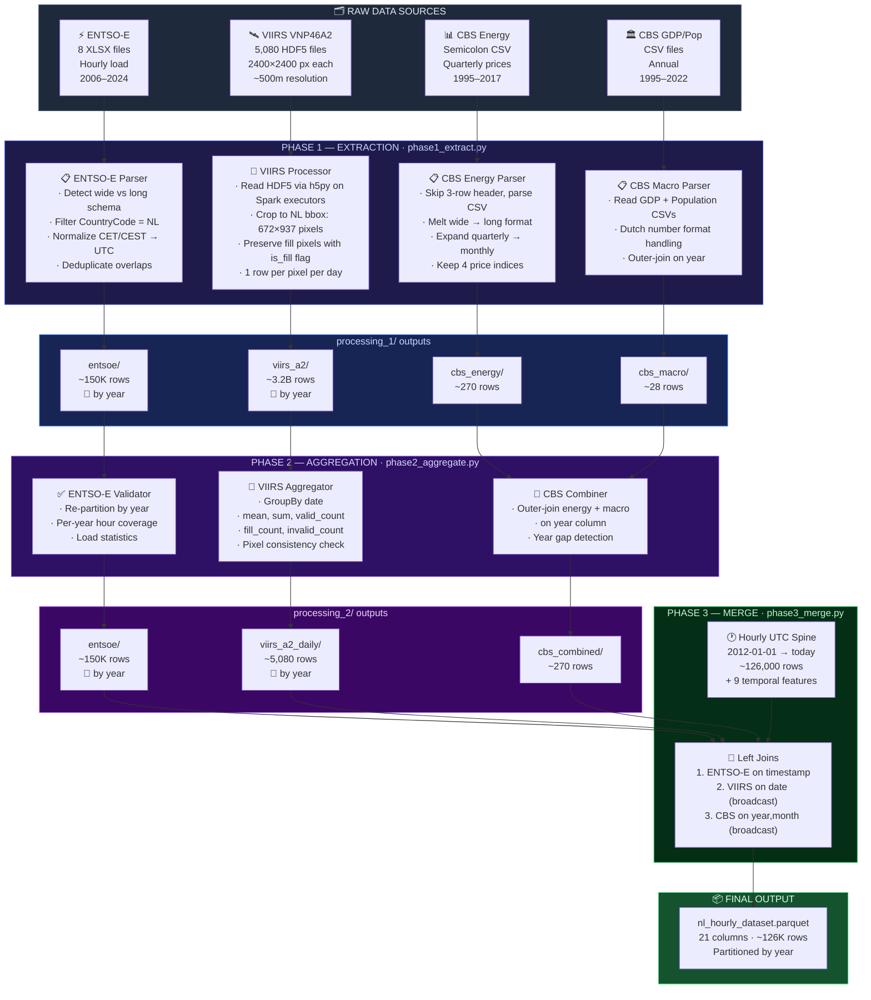
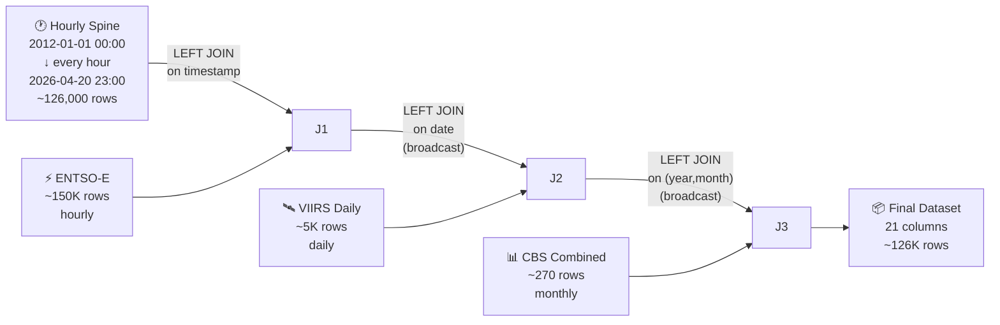
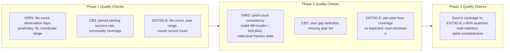

# NL Energy Demand — Data Pipeline Architecture

## Pipeline Overview Diagram



---

## Phase-by-Phase Detailed Breakdown

---

### Phase 1 — Extraction (`phase1_extract.py`)

> **Goal**: Read each raw heterogeneous source independently, clean it, and write a typed, normalised Parquet file. No cross-source logic.

---

#### 1A. VIIRS VNP46A2 — Satellite Nighttime Light

```
Input:  data/viirs/A2/*.h5  (5,080 files, ~70 GB total)
Output: data/processing_1/viirs_a2/data/  (partitioned by year)
```

````carousel
**Step 1 — NL Mask Computation**

The first HDF5 file is opened to read the 1D `lat` (2400,) and `lon` (2400,) coordinate arrays. These are **identical across all h18v03 files** (they define the fixed sinusoidal grid).

A Netherlands bounding box filter is applied:
- Latitude:  50.75° – 53.55° N → **672 pixel rows** (indices 1548–2219)
- Longitude:  3.35° –  7.25° E → **937 pixel columns** (indices 804–1740)

These index arrays are computed **once** and broadcast to all Spark executors.
<!-- slide -->
**Step 2 — Parallel HDF5 Reading**

File paths are distributed as a Spark RDD with ~20 files per partition. Each executor runs `h5py` to:
1. Open the `.h5` file
2. Read `Gap_Filled_DNB_BRDF-Corrected_NTL` (float32) — sliced to NL rectangle only
3. Read `Mandatory_Quality_Flag` (uint8) — same slice
4. Parse date from filename (`AYYYYDDD` → `datetime.date`)
<!-- slide -->
**Step 3 — Pixel Row Emission**

For each of the 672 × 937 = **629,664 pixels** per file:

| Column | Type | Description |
|---|---|---|
| `date` | DateType | Observation date |
| `year` | int | Year (partition key) |
| `row_idx` | int | Original raster row index |
| `col_idx` | int | Original raster column index |
| `lat` | double | Latitude (WGS84) |
| `lon` | double | Longitude (WGS84) |
| `ntl_radiance` | float | Raw radiance (nW/cm²/sr), **null if fill** |
| `quality_flag` | short | 0=best, 1=good, 255=no retrieval |
| `is_fill` | boolean | True if pixel was -999.9 (fill value) |

Fill pixels are **retained** (not discarded) so Phase 2 can count them.

**Total rows**: 629,664 × 5,080 ≈ **3.2 billion**
````

---

#### 1B. CBS Energy Prices

```
Input:  data/cbs/Energy__consumption_and_producer_prices*.csv
Output: data/processing_1/cbs_energy/data/  (~270 rows)
```

| Step | Operation |
|---|---|
| 1 | Skip 3-row metadata header (`header=3`), read with `;` delimiter |
| 2 | Filter to rows containing `"Price index"` (discard year-on-year change rows) |
| 3 | Melt from wide to long: each column header is a period label |
| 4 | Parse period strings via regex: `"2012 1st quarter"` → (2012, 1) |
| 5 | Map 4 commodities: total energy, natural gas, crude oil, electricity |
| 6 | Expand quarterly values to all 3 months (Q1 → Jan, Feb, Mar) |
| 7 | Convert `"."` missing markers → null |

**Output schema**: `year, month, cbs_total_energy_price_idx, cbs_natural_gas_price_idx, cbs_crude_oil_price_idx, cbs_electricity_price_idx`

---

#### 1C. CBS Macro (GDP + Population)

```
Input:  data/cbs/table__84087ENG.csv + data/cbs/Population (x million).csv
Output: data/processing_1/cbs_macro/data/  (~28 rows)
```

- GDP: Parse Dutch number format (`.` = thousands, `,` = decimal)
- Population: Handle flexible column naming (Dutch or English)
- **Outer join** on year: preserves years unique to either source

---

#### 1D. ENTSO-E Electricity Load

```
Input:  data/entso-e/*.xlsx  (8 files)
Output: data/processing_1/entsoe/data/  (partitioned by year, ~150K rows)
```

````carousel
**Schema Detection**

Each XLSX file is probed by reading the first 5 rows of its first sheet:
- If columns contain `"Country"` + numeric hour names like `"0.0"` → **wide format** (2006–2015 legacy)
- Otherwise → **long format** (2015+ standard)
<!-- slide -->
**Wide Format Processing (2006–2015)**

```
Raw:  Country | Year | Month | Day | CovRatio | 0.0 | 1.0 | ... | 23.0
       NL       2012    1       1      100      9832  9541  ...  10234
```

1. Filter `Country == 'NL'`
2. Melt 24 hour columns → individual rows
3. Build timestamp from (Year, Month, Day, Hour)
4. Localize as CET → convert to UTC
5. Ambiguous DST hours (fall-back) → set to NaT (dropped)
<!-- slide -->
**Long Format Processing (2015+)**

```
Raw:  MeasureItem | DateUTC | CountryCode | Value | ...
      MHLV         2020-01-01 00:00:00  NL   9832.5
```

1. Filter `CountryCode == 'NL'`
2. Parse `DateUTC` directly as UTC timestamp
3. Prefer `Value` column; fall back to `Value_ScaleTo100` if `Value` is all NaN
<!-- slide -->
**Deduplication**

Multiple files cover overlapping date ranges:
- `MHLV_data-2015-2019.xlsx` and `monthly_hourly_load_values_2019.xlsx` both contain 2019

Strategy: Sort by filename (alphabetical), **keep last** occurrence per timestamp.
Later single-year files override older bulk downloads → picks the more recently published data.

Final: truncate to whole hours with `floor("h")`, drop NaT/NaN rows.
````

---

### Phase 2 — Aggregation (`phase2_aggregate.py`)

> **Goal**: Reduce spatial VIIRS data to daily scalars, combine CBS tables, validate ENTSO-E.

---

#### 2A. VIIRS Daily Aggregates

```
Input:  data/processing_1/viirs_a2/data/  (3.2B pixel rows)
Output: data/processing_2/viirs_a2_daily/data/  (~5,080 rows, partitioned by year)
```

Groups all ~630K pixels per day into **one row per date** with five aggregate columns:

| Column | Aggregation | Filter |
|---|---|---|
| `ntl_mean` | `AVG(ntl_radiance)` | where `is_fill=false AND quality_flag ≤ 1` |
| `ntl_sum` | `SUM(ntl_radiance)` | where `is_fill=false AND quality_flag ≤ 1` |
| `ntl_valid_count` | `COUNT(*)` | where `is_fill=false AND quality_flag ≤ 1` |
| `ntl_fill_count` | `COUNT(*)` | where `is_fill=true` |
| `ntl_invalid_count` | `COUNT(*)` | where `is_fill=false AND quality_flag > 1` |

**Invariant check**: `ntl_valid_count + ntl_fill_count + ntl_invalid_count = 629,664` for every day.

---

#### 2B. CBS Combined

```
Input:  processing_1/cbs_energy/ + processing_1/cbs_macro/
Output: data/processing_2/cbs_combined/data/  (~270 rows)
```

Outer-joins monthly energy prices with annual GDP/population on `year`. Annual figures are replicated to every month of their year. A year-gap check detects any missing calendar years.

---

#### 2C. ENTSO-E Validation

```
Input:  data/processing_1/entsoe/data/
Output: data/processing_2/entsoe/data/  (partitioned by year)
```

Pass-through re-partition with a detailed per-year coverage report:

| Year | Expected Hours | Actual | Coverage |
|---|---|---|---|
| 2012 | 8,784 (leap) | ~8,760 | 99.7% |
| 2020 | 8,784 (leap) | ~8,784 | 100.0% |
| ... | ... | ... | ... |

Also computes load statistics (min/max/mean/stddev) for sanity checking.

---

### Phase 3 — Merge (`phase3_merge.py`)

> **Goal**: Build one contiguous hourly dataset by joining all sources onto a synthetic timestamp spine.



#### Join Details

| # | Source | Join Key | Join Type | Strategy |
|---|---|---|---|---|
| 1 | ENTSO-E | `timestamp` | Left equi-join | Standard sort-merge (both sides ~100K+ rows) |
| 2 | VIIRS | `date` | Left + broadcast | VIIRS table (~5K rows) sent to all executors |
| 3 | CBS | `(year, month)` | Left + broadcast | CBS table (~270 rows) sent to all executors |

#### Temporal Feature Generation

Nine derived columns are added from the `timestamp`:

| Feature | Type | Example |
|---|---|---|
| `year` | int | 2024 |
| `month` | int | 3 |
| `day` | int | 15 |
| `hour` | int | 14 |
| `day_of_week` | int | 1=Sun … 7=Sat |
| `is_weekend` | int | 0 or 1 |
| `day_of_year` | int | 75 |
| `week_of_year` | int | 11 |
| `quarter` | int | 1 |

#### Final Output Schema

```
data/processed/nl_hourly_dataset.parquet/
├── year=2012/
├── year=2013/
├── ...
├── year=2026/
└── data_quality.json
```

| # | Column | Source | Native Res. | Notes |
|---|---|---|---|---|
| 1 | `timestamp` | Spine | Hourly UTC | Primary key |
| 2 | `entsoe_load_mw` | ENTSO-E | Hourly | Target variable (MW) |
| 3 | `ntl_mean` | VIIRS | Daily | Avg radiance, valid pixels only |
| 4 | `ntl_sum` | VIIRS | Daily | Total radiance, valid pixels |
| 5 | `ntl_valid_count` | VIIRS | Daily | Valid pixel count |
| 6 | `ntl_fill_count` | VIIRS | Daily | Fill pixel count |
| 7 | `ntl_invalid_count` | VIIRS | Daily | Cloud/bad quality pixel count |
| 8 | `cbs_total_energy_price_idx` | CBS | Quarterly | Price index (2010=100) |
| 9 | `cbs_natural_gas_price_idx` | CBS | Quarterly | |
| 10 | `cbs_crude_oil_price_idx` | CBS | Quarterly | |
| 11 | `cbs_electricity_price_idx` | CBS | Quarterly | |
| 12 | `cbs_gdp_million_eur` | CBS | Annual | Null after 2022 |
| 13 | `cbs_population_million` | CBS | Annual | Null after 2022 |
| 14–21 | Temporal features | Derived | Hourly | year, month, day, hour, etc. |

---

## Data Quality Reports

Every phase produces a `data_quality.json` alongside its output:



Every JSON contains:
- **Row/column counts**
- **Per-column null count and percentage**
- **Disk size** (bytes + MB)
- **Date range** (min/max of temporal column)
- **Phase-specific extras** (pixel counts, load stats, coverage gaps, year lists)
